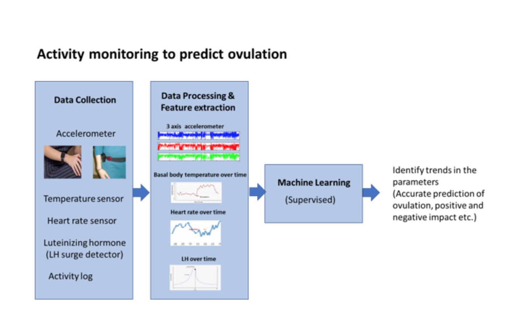
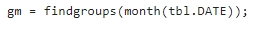
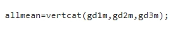
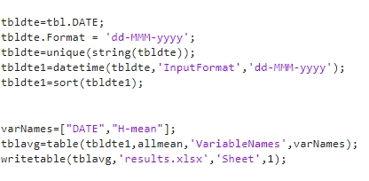
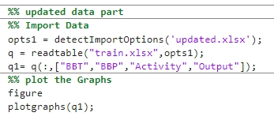
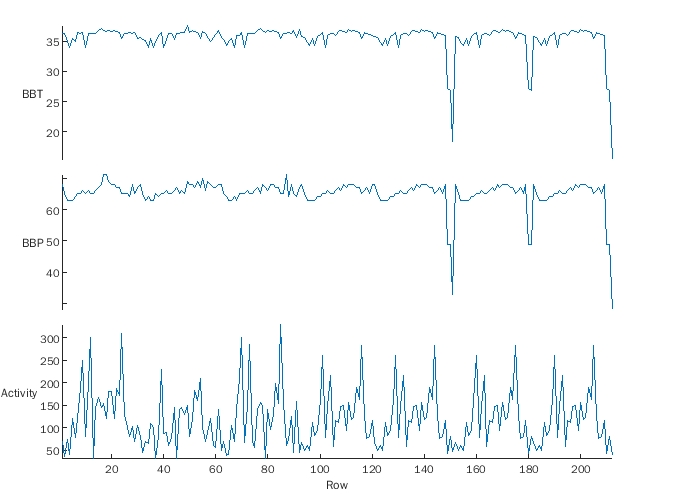

# Monthly-Ovulation-Prediction-matlab

It is a simple project as a student.

# Title: Monthly ovulations Prediction by using Temperature, Heart rate, and Activity.

# Introduction:

Ovulation is part of the menstrual cycle. When the egg has been released
from the ovary it becomes the cause of ovulation.

Understanding when ovulation is going to happen and how it happens it
can be helpful to achieve or prevent pregnancy. Certain medical
conditions can be diagnosed with their help.

Therefore, Prediction of the Monthly Ovulation cycle can be very
helpful. To perform the prediction, nothing is much better than deep
learning neural network.

# Dataset:

Dataset used in this project is obtained through sensors which are
collect data from the body on daily basis. Dataset is consisted of 6
columns which are Date, Body Blood Pressure /Heart Rate (BBP), Body
Temperature (BBT), luteinizing Hormone (LH), Activity Log, and Output.

# Methodology:

We have used a simple neural network in this project

## Define Network Architecture

Define a network with a feature input layer and specify the number of
features. Also, configure the input layer to normalize the data using
Z-score normalization. Next, include a fully connected layer with output
size 50 followed by a batch normalization layer and a ReLU layer. For
classification, specify another fully connected layer with an output
size corresponding to the number of classes, followed by a SoftMax layer
and a classification layer.

## Specify Training Options

-   Train the network using Adam.

-   Train using mini-batches of size 16.

-   Shuffle the data every epoch.

-   Monitor the network accuracy during training by specifying
    validation data.

-   Display the training progress in a plot and suppress the verbose
    command window output.

The software trains the network on the training data and calculates the
accuracy of the validation data at regular intervals during training.
The validation data is not used to update the network weights.

## Train Network

Train the network using the architecture defined by layers, the training
data, and the training options. By default, trainNetwork uses a GPU if
one is available, otherwise, it uses a CPU. Training on a GPU requires
Parallel Computing Toolbox™ and a supported GPU device. For information
on supported devices (Parallel Computing Toolbox). You can also specify
the execution environment by using the \'ExecutionEnvironment\'
name-value pair argument of trainingOptions.

The training progress plot shows the mini-batch loss and accuracy and
the validation loss and accuracy.

# Code:

## Clearing old variables:

## Importing the Training Data:

In this code firstly variables in the training data set are extracted
from the training dataset file which is used to extract the dataset in
the format of the table. Then only columns that are going to be used for
the prediction are selected in the train1 variable.

## Plotting the Dataset:

It uses the custom function to plot the graph which is as:

This function get the table as input and with help of MATLAB built-in
function stackedplot to plot the data which give the output as

In this Graph column of the table is drawn with respect to each point so
that they can be compared easily.

## Training and Testing:

In this function firstly dataset is separated into training, Training
validation, and testing parts

Which are as

Then the neural network is created which is given as

Then using training is done using following code: 

### Training process output:

Testing is done by using the trained model to get the model accuracy.

Which gives the accuracy as 93.94%.

### With the confusion matrix as

## Predicting the dates for next month:

Next month's dates were predicted using the trained model as

Which were as:

#Saving the calculated data:

Then calculated data is saved using the following code

# Calculating the daily activity data:

Data from the sensor is loaded using the following code

As dates are in string format then they are to be converted into
DateTime stamp format so they can be used in the MatLab. Then we have
only H column which is our concerned column of reading from the sensor
is separated from data and at the end table is made by joining Date and
H column.

## Separating the monthly data:

Monthly based data groups are separated using the following code
findgroups is the Matlab builtin function which finds the group in the
given data.

## Separating the daily data:

Then is daily data is separated from each month separately using the
grouping of the months. Then this daily data is used to get the average
of each day using Splitapply and daymean function.

Splitapply is MATLAB built-in function used to separate data based on
groups.

and then we have daymean function which is custom and is used to find
the mean of daily data from 8:00 am to 11:00 pm.

Then an average of each month's day is joint together using the
following code

Then results are saved in file as

## Showing the average data with other columns:

Then this data is added to the dataset in the activity column and
plotted as using code

## Plot:

